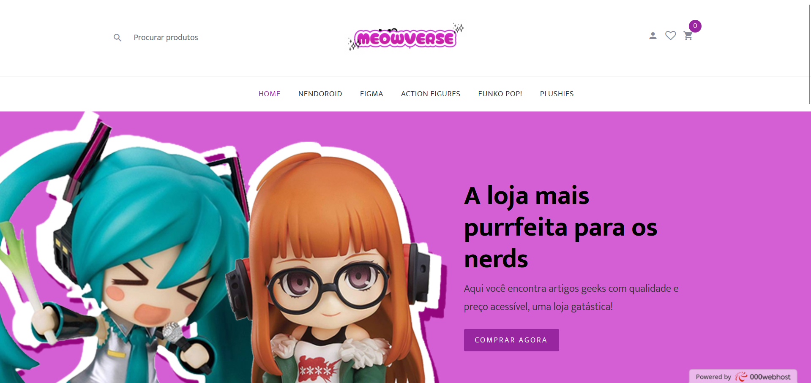
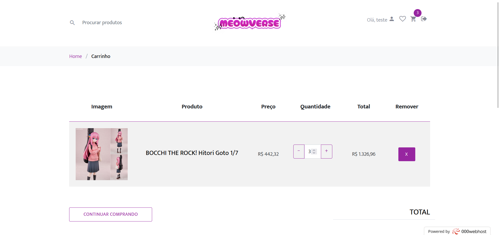
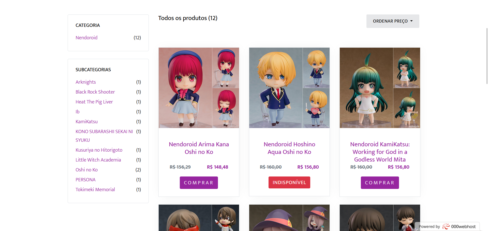

# Meowverse

**Meowverse** is a web store which sells figurines, leading the client through all customer experience and successfully makes checkouts. This project was my Final Paper for the Web Development Technician course I undertook, thus my first fullstack project. The modularization and project design isn't the best and will be fixed in the future, as well as code logic and refactoration. 

## Screenshots

## Functionalities
- Product search: through name, category, price, availability, series;
- Account sign up, log in and sign out;
- Buying history;
- Cart removal and addition, usage of coupons;
- Product details;
- Payment through Pix, Debit/Credit cards and Payment Slip.

## How to run locally
Step by step guide of how to run the project locally on your machine.

### Pre-requisites
- **PHP**: check installation at the [official website](https://www.php.net/manual/en/install.php)
- **MySQL**: check installation at the [official website](https://dev.mysql.com/downloads/installer/)
- A local server of your choice; I recommend [XAMPP](https://www.apachefriends.org/pt_br/download.html)

## Installation
TBD

## Running locally
TBD

## APIs
TBD

## Future improvements
TBD

## Author

***Lumah Pereira***

  
